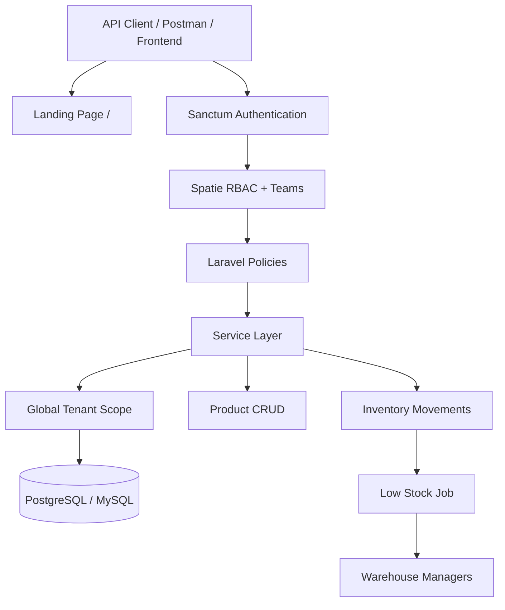

# Multi-Tenant Inventory Management System


A production-ready **SaaS backend** built with Laravel 12, designed to serve multiple independent organizations with complete data isolation, role-based access control, and real-time stock monitoring.

**Live Demo:** `https://YOUR-APP.onrender.com` *(update after deploying to Render)*

---

## Features

- **Multi-Tenancy** — Complete data isolation between tenants via global scopes on all models
- **Authentication** — Token-based auth using Laravel Sanctum
- **Role-Based Access Control** — Three roles (Viewer, Operator, Warehouse Manager) powered by Spatie Laravel Permission
- **Product Management** — Full CRUD with pricing, descriptions, and low-stock thresholds
- **Inventory Movement Tracking** — Record inbound/outbound stock movements with validation and database locking
- **Low Stock Notifications** — Queue-based job system that notifies warehouse managers automatically
- **RESTful API** — Clean, consistent JSON responses with proper HTTP status codes
- **OpenAPI Docs** — Auto-generated interactive documentation via Scramble
- **CI/CD** — GitHub Actions running tests and code style checks

---

## Tech Stack

| Layer | Technology |
|---|---|
| Framework | Laravel 12 |
| Language | PHP 8.2+ |
| Database | PostgreSQL / MySQL |
| Authentication | Laravel Sanctum |
| Authorization | Spatie Laravel Permission + Laravel Policies |
| Queue | Database |
| API Docs | Scramble (OpenAPI) |
| CI | GitHub Actions |
| Deployment | Render |

---

## System Architecture



**Application layers:**

```
Controllers → Services → Models
     ↓
  Policies + Form Requests
     ↓
  API Resources + ApiResponse trait
```

**Services:**
- `AuthService` — registration, login, logout
- `ProductService` — product CRUD and low-stock queries
- `InventoryService` — stock movements with row locking
- `UserService` — role assignment

---

## Database Structure

| Table | Purpose |
|---|---|
| `tenants` | Company/organization accounts |
| `users` | User accounts linked to a tenant |
| `products` | Product catalog per tenant (includes cached `quantity`) |
| `inventory_movements` | Stock in/out transactions |
| `roles` / `permissions` | RBAC via Spatie |

**Key Relationships:**
- Tenant → Users (1:Many)
- Tenant → Products (1:Many)
- Product → Inventory Movements (1:Many)

---

## API Endpoints

### Authentication
| Method | Endpoint | Description |
|---|---|---|
| POST | `/api/register` | Register a new company and first admin user |
| POST | `/api/login` | Login and receive token |
| POST | `/api/logout` | Revoke current access token (authenticated) |

> Login and register are rate-limited to 6 requests per minute per IP.

### Products
| Method | Endpoint | Description |
|---|---|---|
| GET | `/api/products` | List products (paginated) |
| POST | `/api/products` | Create a product |
| GET | `/api/products/{product}` | Show a product |
| PUT/PATCH | `/api/products/{product}` | Update a product |
| DELETE | `/api/products/{product}` | Delete a product |
| GET | `/api/products/low-stock` | Get products below threshold |

### Inventory
| Method | Endpoint | Description |
|---|---|---|
| POST | `/api/products/{product}/movements` | Record stock movement (in/out) |

### Users
| Method | Endpoint | Description |
|---|---|---|
| GET | `/api/users` | List users (paginated) |
| POST | `/api/users/{user}/assign-role` | Assign role to user |

---

## API Response Format

```json
{
  "status": "success",
  "message": "Products retrieved successfully.",
  "data": []
}
```

Paginated resource responses also include Laravel's standard `links` and `meta` keys.

---

## Quick Start

### Local Development

```bash
git clone https://github.com/mahmoud-aljabour/Multi-Tenant-Inventory-Management
cd Multi-Tenant-Inventory-Management
composer install
cp .env.example .env
php artisan key:generate
php artisan migrate --seed
php artisan serve
```

Visit `http://localhost:8000` for the portfolio landing page.

### Deploy to Render

See **[docs/DEPLOYMENT.md](docs/DEPLOYMENT.md)** for step-by-step instructions.

```bash
# Render uses render.yaml Blueprint — connect repo in Render dashboard
# Set APP_URL to your Render service URL after first deploy
```

---

## Demo Credentials

After running `php artisan migrate --seed`, use these accounts (password for all: `password`):

| Tenant | Email | Role |
|---|---|---|
| Acme Electronics | manager@acme.test | warehouse_manager |
| Acme Electronics | operator@acme.test | operator |
| Acme Electronics | viewer@acme.test | viewer |
| Beta Supplies Co. | manager@beta.test | warehouse_manager |
| Beta Supplies Co. | operator@beta.test | operator |

---

## API Documentation

Interactive OpenAPI docs:

```
/docs/api
```

Powered by [Scramble](https://github.com/dedoc/scramble). Use the **Authorize** button and paste your Sanctum bearer token after login.

---

## Postman Collection

Import these files into Postman:

| File | Environment |
|---|---|
| `docs/postman/Multi-Tenant-Inventory.postman_collection.json` | Collection |
| `docs/postman/Local.postman_environment.json` | Local (`localhost:8000`) |
| `docs/postman/Production.postman_environment.json` | Production (update URL) |

Run **Auth → Login** first — the collection auto-saves the bearer token.

---

## Testing

```bash
php artisan test
vendor/bin/pint --test
```

**Test coverage includes:**
- Authentication (register, login, logout)
- RBAC (role permissions per endpoint)
- Tenant isolation (cross-tenant access blocked)
- Product CRUD
- Inventory movements and stock validation
- Low stock job dispatch

CI runs automatically via GitHub Actions on push/PR to `main`.

---

## Portfolio Resources

| Resource | Path |
|---|---|
| Case Study | [docs/CASE_STUDY.md](docs/CASE_STUDY.md) |
| Deployment Guide | [docs/DEPLOYMENT.md](docs/DEPLOYMENT.md) |
| Demo Video Script | [docs/DEMO_SCRIPT.md](docs/DEMO_SCRIPT.md) |

---

## Roles & Permissions

| Role | Permissions |
|---|---|
| Viewer | View products |
| Operator | View products, manage inventory movements |
| Warehouse Manager | Full access — products, inventory, users |

---

## Author

**Mahmoud Maher Al Jbour**  
Backend Developer | Laravel & PHP Specialist  
[GitHub](https://github.com/mahmoud-aljabour) · [LinkedIn](https://linkedin.com/in/mahmoud-aljabour)
